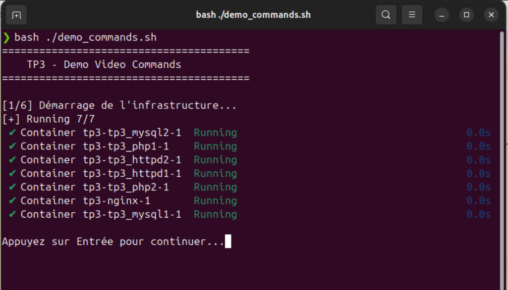
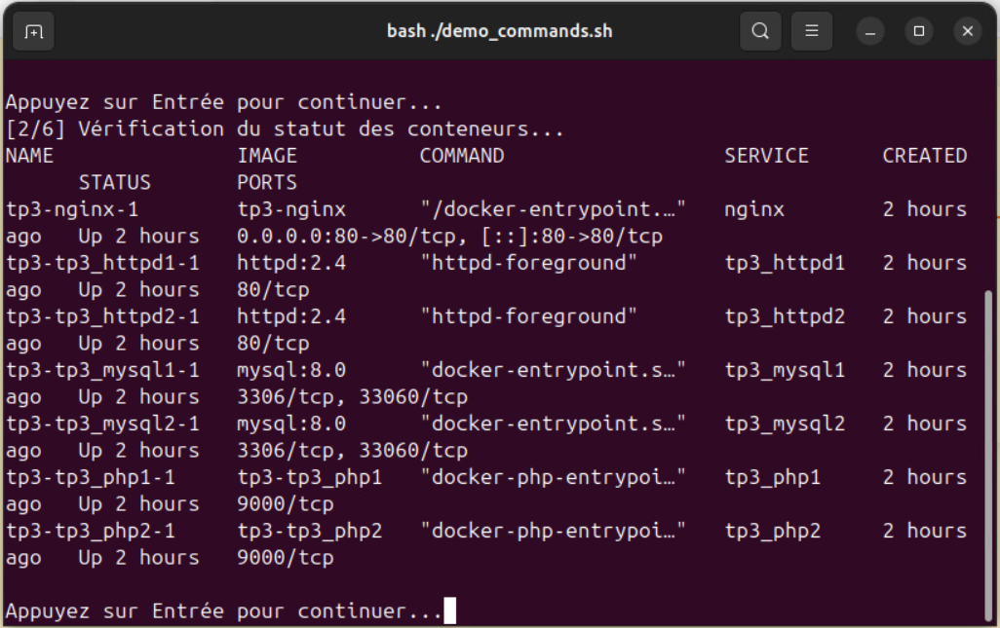
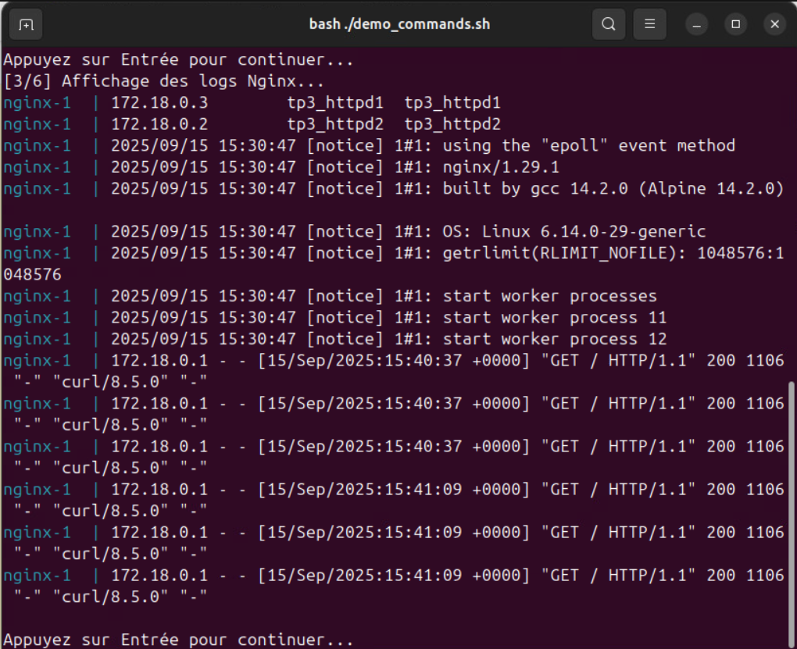
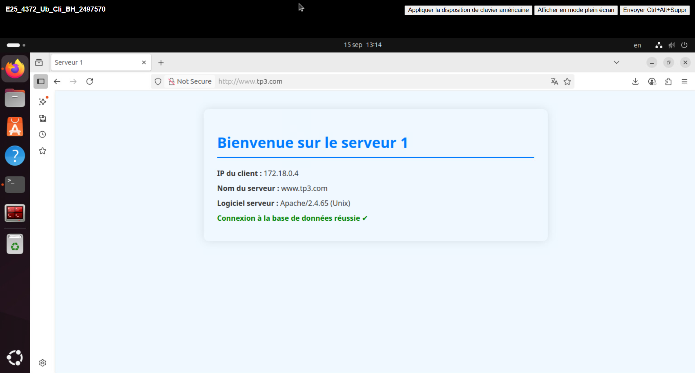
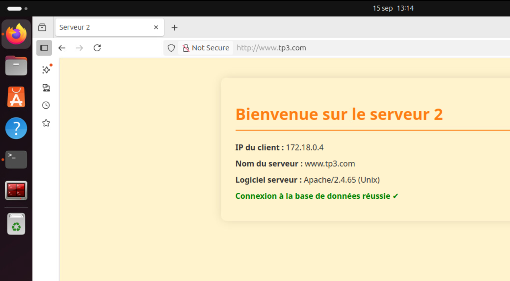

<!-- PROJECT LOGO -->
<br />
<div align="center">
  <a href="https://github.com/majeurbilly/ISS---TP3">
    
  </a>

  <h3 align="center">TP3 - Service Web avec Équilibrage de Charge 🚀</h3>

  <p align="center">
    Infrastructure web complète avec équilibrage de charge utilisant Docker Compose
    <br />
    <a href="#about"><strong>Explorer l'architecture »</strong></a>
      <br />
      <br />
      <a href="https://github.com/majeurbilly/ISS---TP3/issues/new?assignees=&labels=bug&template=01_BUG_REPORT.md&title=bug%3A+">Signaler un Bug</a>
      ·
      <a href="https://github.com/majeurbilly/ISS---TP3/issues/new?assignees=&labels=enhancement&template=02_FEATURE_REQUEST.md&title=feat%3A+">Demander une Fonctionnalité</a>
      ·
      <a href="https://github.com/majeurbilly/ISS---TP3/issues/new?assignees=&labels=question&template=04_SUPPORT_QUESTION.md&title=support%3A+">Poser une Question</a>
  </p>
</div>


  ## Table des Matières
  <ol>
    <li>
      <a href="#about">À Propos</a>
      <ul>
        <li><a href="#built-with">Technologies Utilisées</a></li>
      </ul>
    </li>
    <li>
      <a href="#getting-started">Démarrage</a>
      <ul>
        <li><a href="#prerequisites">Prérequis</a></li>
        <li><a href="#installation">Installation</a></li>
      </ul>
    </li>
    <li><a href="#usage">Utilisation</a></li>
    <li><a href="#monitoring-tools-overview">Aperçu des Outils de Surveillance</a></li>
    <li><a href="#authors--contributors">Auteurs et Contributeurs</a></li>
    <li><a href="#acknowledgments">Remerciements</a></li>
  </ol>


<!-- À PROPOS DU PROJET -->
## À Propos

Ce projet implémente une architecture de service web avec équilibrage de charge selon le schéma suivant :

```
www.tp3.com → Nginx (Équilibreur) → Serveur Apache 1/2 → PHP-FPM → MySQL
```

### Architecture des Réseaux

- **front_net** : Réseau frontal pour la communication externe
- **back1_net** : Réseau arrière pour serveur 1 (Apache + PHP + MySQL)
- **back2_net** : Réseau arrière pour serveur 2 (Apache + PHP + MySQL)

### Configuration MySQL

Chaque instance MySQL dispose d'une configuration personnalisée (`my.cnf`) optimisée pour l'environnement Docker :

- **Charset** : UTF8MB4 avec collation unicode
- **Performance** : Buffer pool InnoDB, logs optimisés
- **Sécurité** : Mode SQL strict, désactivation des fonctions sensibles
- **Monitoring** : Logs d'erreur et requêtes lentes activés
- **Identification** : Server-id unique (1 et 2) pour la réplication future

<details>
 <summary>
    <a href="#images">
      
    </a>
 </summary>
<br>
🏗️ Architecture Docker Compose  

<br>

<br>

<br>

<br>

<br>

<br>


</details>

### Technologies Utilisées

- **Docker Compose** - Orchestration des conteneurs
- **Nginx** - Équilibreur de charge (Load Balancer)
- **Apache (httpd)** - Serveurs web (2 instances identiques)
- **PHP-FPM** - Processeurs PHP FastCGI (2 instances)
- **MySQL** - Bases de données (2 instances avec volumes persistants et configuration personnalisée)

## Démarrage

### Prérequis

Pour travailler avec ce projet, vous devez avoir :

- **Docker Desktop** - Version 4.0 ou plus récente
- **Docker Compose** - Version 2.0 ou plus récente
- **Git** - Pour cloner le dépôt

### Installation

1. Ouvrez votre **terminal**.
2. Clonez le dépôt :
   ```bash
   git clone https://github.com/majeurbilly/ISS---TP3.git
   ```
3. Naviguez vers le répertoire du projet :
   ```bash
   cd ISS---TP3
   ```
4. Démarrez Docker Desktop et attendez qu'il s'initialise
5. Lancez le programme :
   ```bash
   docker-compose up -d
   ```

## Utilisation

### Services Backend

1. Dans le répertoire racine du projet, démarrez tous les services :
   ```bash
   docker-compose up -d
   ```

2. Vérifiez le statut des conteneurs :
   ```bash
   docker-compose ps
   ```

3. Consultez les logs :
   ```bash
   docker-compose logs nginx
   docker-compose logs tp3_httpd1
   docker-compose logs tp3_httpd2
   ```

4. Testez l'équilibrage de charge :
   ```bash
   curl http://localhost
   # Rafraîchissez plusieurs fois pour voir l'alternance des serveurs
   ```

5. Arrêtez et nettoyez :
   ```bash
   docker-compose down
   ```

### Test d'Équilibrage de Charge

1. Accéder à http://localhost (ou www.tp3.com si configuré dans /etc/hosts)
2. Rafraîchir la page plusieurs fois
3. Observer l'alternance entre "Serveur 1" et "Serveur 2"
4. Vérifier la connexion à la base de données sur chaque serveur

## Aperçu des Outils de Surveillance

### **Logs Docker Compose**
```bash
# Voir tous les logs
docker-compose logs

# Voir les logs d'un service spécifique
docker-compose logs nginx
docker-compose logs tp3_httpd1
docker-compose logs tp3_php1
docker-compose logs tp3_mysql1

# Logs MySQL détaillés (erreurs et requêtes lentes)
docker-compose exec tp3_mysql1 tail -f /var/log/mysql/error.log
docker-compose exec tp3_mysql1 tail -f /var/log/mysql/slow.log
```

### **Statut des Conteneurs**
```bash
# Vérifier les conteneurs en cours d'exécution
docker-compose ps

# Vérifier la santé des conteneurs
docker-compose top
```

### **Inspection des Réseaux**
```bash
# Lister les réseaux
docker network ls

# Inspecter un réseau spécifique
docker network inspect tp3_front_net
docker network inspect tp3_back1_net
docker network inspect tp3_back2_net
```

### **Monitoring MySQL**
```bash
# Connexion aux bases de données
docker-compose exec tp3_mysql1 mysql -u tp3user -ptp3pass tp3db
docker-compose exec tp3_mysql2 mysql -u tp3user -ptp3pass tp3db

# Vérifier la configuration MySQL
docker-compose exec tp3_mysql1 mysql -u root -prootpass1 -e "SHOW VARIABLES LIKE 'server_id';"
docker-compose exec tp3_mysql2 mysql -u root -prootpass2 -e "SHOW VARIABLES LIKE 'server_id';"

# Vérifier les tables de démonstration
docker-compose exec tp3_mysql1 mysql -u tp3user -ptp3pass tp3db -e "SELECT * FROM demo;"
```

## Vidéo de Démonstration

🎥 **Vidéo de démonstration complète** : [https://www.youtube.com/watch?v=vv69r4etJvo](https://www.youtube.com/watch?v=vv69r4etJvo)

Cette vidéo de 8 minutes démontre :
- Le lancement des conteneurs Docker
- L'affichage des sites web avec équilibrage de charge
- L'analyse des journaux (logs) des services
- L'arrêt et le nettoyage des conteneurs
- L'explication des configurations et de l'architecture

## Auteurs et Contributeurs

- **majeurbilly** - *Travail initial* - [majeurbilly](https://github.com/majeurbilly)

## Remerciements

Remerciements :

* [Documentation Docker](https://docs.docker.com/)
* [Documentation Nginx](https://nginx.org/en/docs/)
* [Documentation Apache HTTP Server](https://httpd.apache.org/docs/)
* [Documentation PHP-FPM](https://www.php.net/manual/en/install.fpm.php)
* [Documentation MySQL](https://dev.mysql.com/doc/)
* [Documentation Docker Compose](https://docs.docker.com/compose/)
* [MySQL 8.0 — Using Option Files](https://dev.mysql.com/doc/refman/8.0/en/option-files.html)
* [MySQL 8.0 — Server System Variables](https://dev.mysql.com/doc/refman/8.0/en/server-system-variables.html)
* [MySQL 8.0 — Character Set Support](https://dev.mysql.com/doc/refman/8.0/en/charset-general.html)
* [Docker Hub — Official MySQL Image](https://hub.docker.com/_/mysql)
* [PHP — PDO](https://www.php.net/manual/en/book.pdo.php) et [PDO_MySQL](https://www.php.net/manual/en/ref.pdo-mysql.php)
* [Compose file reference](https://docs.docker.com/compose/compose-file/)

## Sécurité / Secrets (à améliorer hors scope du TP)

- TODO: remplacer les identifiants de démonstration (utilisateurs et mots de passe MySQL) et stocker les info sensible en dehors du dépôt.
- Recommandations:
  - Utiliser des variables d’environnement via un fichier `.env` non versionné.
  - Chiffrer les fichiers de configuration sensibles (YAML/TXT) avec un outil comme [rage](https://github.com/str4d/rage) ou un gestionnaire de secrets (ex.: Pulumi Secrets, HashiCorp Vault, AWS Secrets Manager).
  - Déchiffrer au runtime dans le pipeline CI/CD ou à l’entrée du conteneur.

<p align="right">(<a href="#readme-top">retour en haut</a>)</p>  
